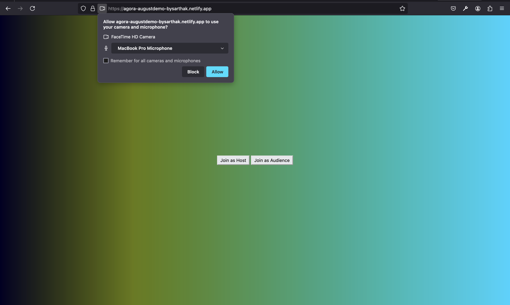
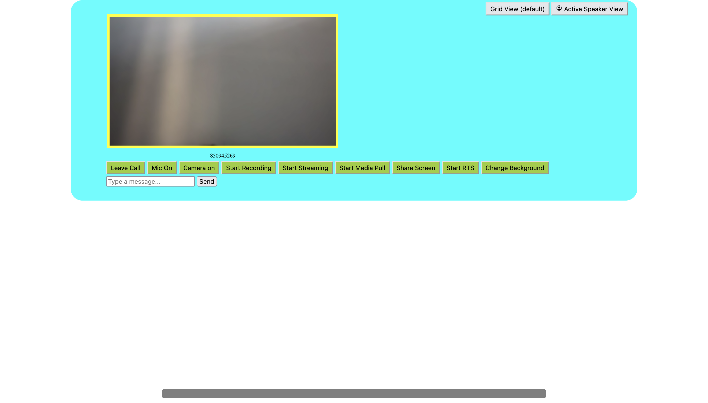
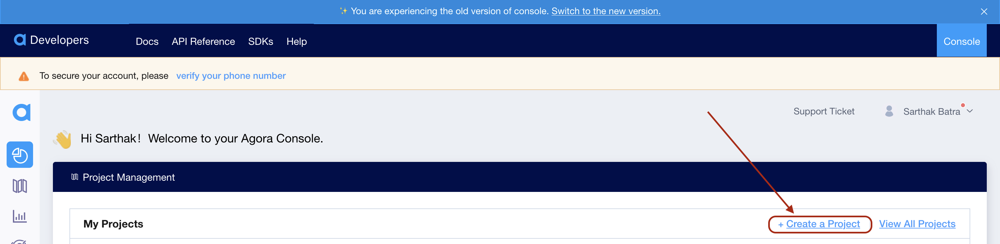
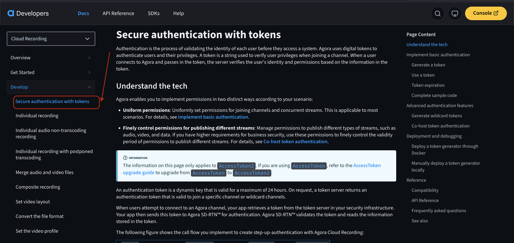

# This project is still WIP. Please use appropriate caution when using this as a template. Reach out to the maintainer for help. 

# Agora Video Call Project

Demo for a web-based video calling application using the Agora RTC SDK for video and
audio communications and the Agora Signaling SDK for messaging.


## Run Locally

### Please note: The project is written in plain HTML and CSS but it is scaffolded with [Vite](Vitejs.dev) - ie, it does need a server to run Javascript Modules which are installed.

### Clone the project

```bash
  git clone https://github.com/sarthak1991/agora-test
```

### Go to the project directory

```bash
  cd Agora-SDK-Web
```

### Install dependencies

```bash
  npm install
```
or 
```bash
 yarn install
```

### Start the server


```bash
  npm run start
```
 or 

```bash
  yarn start
``` 
> [!CAUTION]  
> For the project to run, you must populate the CONSTS.js file found at helpers/CONSTS.js.

> [!WARNING]  
> For the project to run successfully, you must also setup your own token authentication server as described [here](https://github.com/AgoraIO-Community/agora-token-service) which generates tokens and handles the API requests 


### Project Screenshots


- When the call starts, the project asks you for relevant permissions. Please grant those permissions


- This is the interface you see when the project is running. Go Ahead and try all those buttons, whose descriptions are provided below. 

## Requirements
To run this project, you should have the following on your computer

- npm - to run project and install dependencies. (Node Package Manager. Comes packaged with NodeJS Runtime)
- A browser. To view the demo. (Any broser of choice. I used Firefox Developer Edition while making/testing this)
- An Agora Account on the [Agora console](https://console.agora.io)

## Setup 

### Setup An Agora Account

- Go to [Agora console](https://console.agora.io) and make an account. 


- Enable and copy the Primary Certificate (This would be used later to enable a token based auth on your project )

- Similary, copy and save your App Id

## Components and SDKs used

### Agora RTC SDK: 
- Used to enable real time Audio and Video between two clients [as described here](https://docs.agora.io/en/video-calling/get-started/get-started-sdk?platform=web)

- You need to set up an authentication server to generate your own secure tokens [as described here](https://docs.agora.io/en/video-calling/get-started/authentication-workflow?platform=web) 


### Signalling SDK
 - Signalling SDK by Agora is an SDK that allows the transfer of text based messages from a publisher to a subscriber or peer to peer. 

 - In this project, it is used to broadcast messages between participants. 

 - To get started with Signalling SDK, follow this [link](https://docs.agora.io/en/signaling/get-started/sdk-quickstart?platform=web)

 ## Restful Services 

 Agora provides a bunch of services that can be enabled/called upon with simple Restful APIs bearing your authentication details found on [Agora Console](https://console.agora.io/)

 

 - You'll find the list of supported restful services and their API documentation [here](https://documenter.getpostman.com/view/6319646/SVSLr9AM#intro)

 ### Cloud Recording

 - Agora offers single participant, composite and web recording for the Video Call UI that can be saved on-premise or on your cloud provider of choice by simply calling the relevant API. 
 - This project uses Web Recording and saves the recording over Amazon's AWS cloud.
- Please refer to the documentation about the structure of the API as provided above. 

### Media Push
- Media push allows you to push your interactive live stream/video call over an RTMP source (can be obtained with your live streaming source of choice, like YouTube, Twitch, etc)

- Please refer to the documentation about the structure of the API as provided above. 

### Media Pull

- Media Pull is used to bring an external Live-Stream source into your call. 

- Please refer to the documentation about the structure of the API as provided above. 

### RTT (Real Time Transcription)

- This service is used to enable real-time text to speech transcriptions of participants' words during the video call. 

- Please refer to the documentation about the structure of the API as provided above. 


## Tech Stack

**Client:** HTML5, CSS3, TailwindCSS, Javascript as modules

**Server:** Nodejs, Expressjs + npm.

**Libraries:** AgoraRTC sdk Verion 4.20.0, Agora Signaling SDK Version 1.5.1 available for download [here](https://docs-beta.agora.io/en/sdks?platform=web). 

*Note: The SDKs are installed as packages using the npm package manager so you wont find downloaded SDKs in this project.*


## Author

- [@sarthak1991](https://www.github.com/sarthak1991)


